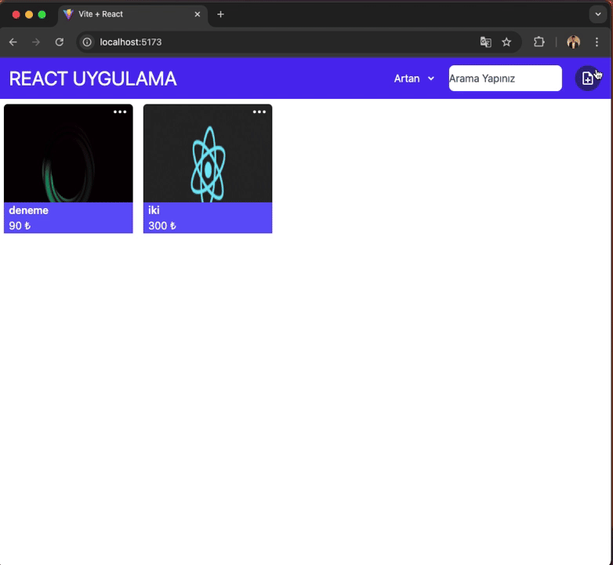

# Ürün Yönetim Uygulaması

Bu uygulama, kullanıcıların ürünleri ekleyip güncelleyebileceği, silebileceği, arama yapabileceği ve fiyatlarına göre sıralayabileceği bir ürün yönetim sistemidir. React ile geliştirilmiştir ve Redux ile veri yönetimi yapılmaktadır.

## Özellikler

- **Ürün Ekleme**: Yeni ürünler ekleyebilirsiniz.
- **Ürün Güncelleme**: Var olan ürünleri güncelleyebilirsiniz.
- **Ürün Silme**: Ürünleri silebilirsiniz.
- **Arama**: Ürün adında arama yaparak ilgili ürünleri listeleyebilirsiniz.
- **Fiyata Göre Sıralama**: Ürünleri fiyatlarına göre artan veya azalan sırayla sıralayabilirsiniz.

## Kullanılan Kütüphaneler

- **React**: Kullanıcı arayüzünü oluşturmak için.
- **@reduxjs/toolkit**: Uygulamanın durum yönetimi için.
- **@tailwindcss/vite**: Hızlı ve kolay stil verme için Tailwind CSS.
- **react-icons**: Uygulama için ikonlar eklemek amacıyla.
- **react-redux**: Redux ile React entegrasyonu sağlamak için.
- **react-router-dom**: Uygulama içinde sayfa yönlendirmeleri yapmak için.

# GİF

